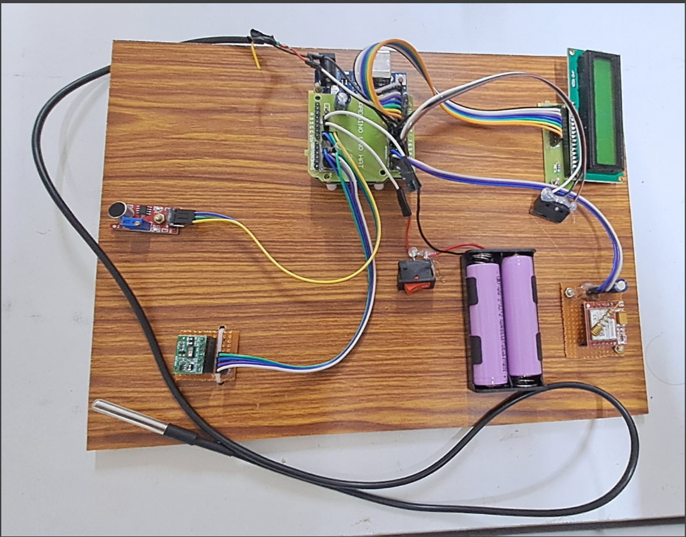
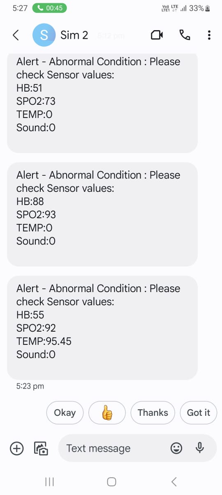

# Patient HealthCare Monitoring System

## Overview

This project was developed as part of my B.Tech coursework to monitor a patient's health parameters using Arduino. The system measures heart rate, estimates SpO₂, monitors temperature, and checks sound levels. If any reading exceeds predefined threshold values, the GSM module automatically sends an SMS alert and initiates a phone call to the configured emergency contacts.

The project demonstrates the integration of multiple sensors with an Arduino-based embedded system for basic healthcare monitoring.

---

## Features

- Heart rate monitoring
- Estimated SpO₂ monitoring
- Temperature monitoring
- Sound detection
- Emergency push button
- Real-time LCD display
- SMS alert using GSM module
- Automatic emergency calling

---

## Hardware Used

- Arduino Uno
- MAX30105 Pulse Oximeter Sensor
- GSM Module
- 16×2 LCD Display
- Sound Sensor
- Push Button
- Battery Pack

---

## Software Used

- Arduino IDE
- Embedded C++
- MAX30105 Library
- Heart Rate Library

---

## Project Working

The MAX30105 sensor continuously measures heart rate and estimates SpO₂ values. Temperature, sound sensor readings, and the emergency push button are also monitored. All readings are displayed on the LCD.

Whenever any parameter crosses the predefined threshold, the Arduino communicates with the GSM module using AT commands. The GSM module sends an SMS containing the current sensor values and places a call to the configured emergency contacts.

---

## Hardware Setup



---

## SMS Alert



---

## Repository Structure

```
Patient-HealthCare-Monitoring-System
│
├── Arduino_Code/
│   └── Patient_HealthCare_Monitoring.ino
│
├── Images/
│   ├── hardware_setup.jpg.png
│   └── sms_alert_output.jpg.jpeg
│
├── README.md
└── LICENSE
```

---

## Future Improvements

- Cloud-based monitoring
- Mobile application integration
- GPS location tracking
- Patient data logging
- Web dashboard

---

## Author

**Monanvitha Nampalli**

B.Tech – Computer Science and Engineering

Vellore Institute of Technology
